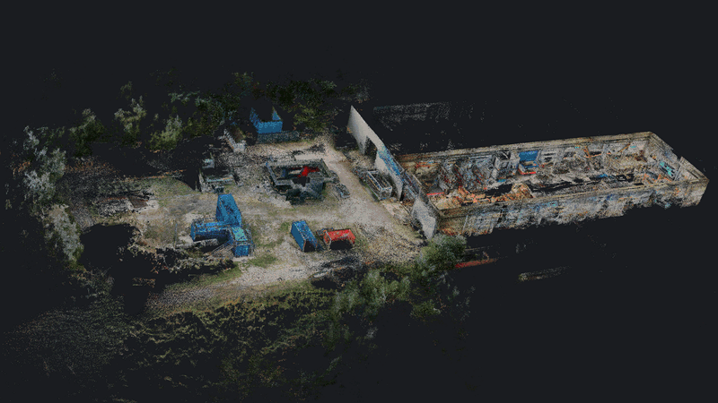
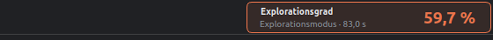

# Super360 Studio



Bis 2026-09 hieß das Programm „RosBag Suite 360".

PyQt5-GUI für die Auswertung der Drohnen-Rosbags (ROS2 Humble, Livox Mid-360 +
Dual-Fisheye-360°-Kamera "paycam" + mavros-GPS):

1. **Punktwolke (FAST-LIO2)** — berechnet aus dem Bag die dichteste Karte
   (`whs_dense.yaml`: alle gültigen Punkte, volle Scans via
   `/cloud_registered_body` + `/Odometry`) und zeigt sie im 3D-Viewer (VTK).
2. **360°-Video** — stitcht die Dual-Fisheye-Frames Docker-frei (OpenCV-Remap,
   Double-Sphere-Kalibrierung aus `Super360_Stitcher_rosbag`) und spielt sie ab
   (Zoom aufs Mausrad, Pan, Frame-genaues Springen, 180°-Drehung).
3. **Einfärbung** — färbt die Punktwolke aus den 360°-Bildern ein; zu dunkle /
   zu helle Pixel (Schieber „Helligkeit von“ / „Helligkeit bis“) werden
   ausgefiltert, nicht eingefärbte Punkte lassen sich ausblenden („Nur eingefärbte
   Punkte").
   Kamera-Extrinsik: grobe Kamera-Kalibrierung („Automatisch kalibrieren (grob)“)
   + manuelle Feinjustage (Gier/Nick/Roll/X/Y/Z), Sichtprüfung mit
   „Überlagerung prüfen“.
4. **GPS** — prüft IMMER die Signalqualität (fix_type, Satelliten, eph/HDOP,
   Kovarianz, Bewegungs-Baseline; Sentinel-Werte werden erkannt). Nur bei
   brauchbarem Signal wird die LIO-Trajektorie per gewichteter
   4-DOF-Ausrichtung (Yaw + Translation, Gewichte 1/eph²) auf ENU/UTM
   georeferenziert; Residuen (RMS) werden ausgewiesen.
5. **Export** — PLY/PCD (lokal) und LAS (georeferenziert in UTM, falls GPS
   brauchbar; exakte pyproj-Projektion).

## Bedienung im Überblick

Oben die Menüleiste (**Datei**, **Ablauf**, **Ansicht**, **Werkzeuge**, **Hilfe**),
rechts die Seitenleiste mit den Einstellungen. Jeder Abschnitt der Seitenleiste
klappt einzeln auf und zu, die Reihenfolge folgt dem Arbeitsablauf. Welche
Abschnitte offen sind, merkt sich das Projekt. **Werkzeuge → Einstellungen auf
Vorgabe** setzt die Werte des Projekts nach Rückfrage zurück; der Klappzustand
bleibt.

Während ein Schritt läuft (Karte, Einfärben, Ausrichten …), sind die übrigen
Befehle grau; ihr Tooltip endet dann mit „Gesperrt, solange ein Schritt läuft.“
Auch sonst nennt der Tooltip eines grauen Knopfes oder Menüeintrags, was fehlt,
etwa „Erst ein Rosbag öffnen.“ Abgebrochen wird über den Knopf in der Statusleiste.

Das Menü **Ansicht** führt Farbe, Hintergrund, Bereich (die Reiter 3D-Karte,
360°-Video, GPS, Protokoll) und Kantenbetonung (EDL); Hintergrund und
Kantenbetonung ziehen mit dem Abschnitt **Anzeige** der Seitenleiste gleich. Dort
stehen außerdem „Nur eingefärbte Punkte“, „Anzeige-Voxel“ (dünnt nur die Anzeige
aus) und „Flugbahn zeigen“.

Die Seitenleiste ist frei in der Breite: am Trenner zur 3D-Ansicht ziehen, die
gezogene Breite bleibt erhalten (für alle Projekte). Breitere Leiste, breitere
Felder; wird sie schmal, rücken Knöpfe untereinander, und lange Haken- und
Knopftexte brechen um. Schmaler als der breiteste Abschnittskopf lässt sie sich
nicht ziehen. `Strg+B` (**Ansicht → Seitenleiste**) blendet sie ganz aus und
wieder ein.

Ganz oben rechts steht der **Explorationsgrad** des offenen Fluges — wie viel des
Zielgebiets die Drohne im Explorationsmodus gesehen hat (s. unten).

Kurzbefehle: `Strg+O` Rosbag öffnen, `Strg+Umschalt+P` Projekt aus dem Cache,
`Strg+I` exportiertes Projekt öffnen, `Strg+Umschalt+O` zweiten Flug laden,
`F5` Karte berechnen, `F6` einfärben (360°-Kamera), `F7` Mäander einfärben,
`M` messen, `R` Ansicht zurücksetzen, `Esc` Messung weg, `Strg+H` Höhenschnitt
aufheben, `Strg+E` PLY/PCD speichern, `Strg+Umschalt+E` Projekt exportieren,
`Strg+P` 3D-Ansicht als Bild, `Strg+B` Seitenleiste, `Strg+Q` beenden.

## Vor dem ersten Start

Getestet auf **Ubuntu 22.04** mit dem System-Python **3.10** und einem
Grafiktreiber mit OpenGL ≥ 3.2 (die 3D-Ansicht ist VTK). Was davon da ist,
prüft ein Skript und sagt zu jedem fehlenden Teil den Befehl:

```bash
python3 scripts/pruefe_installation.py
```

Was man braucht, hängt davon ab, was man machen will:

| Teil | wofür | Pflicht? |
|---|---|---|
| PyQt5, VTK (apt) + Python-Pakete (pip) | App starten, Projekte öffnen, ansehen, messen, exportieren | **ja** |
| PointCloudMerger (Nachbar-Repo) | Mäander-Einfärbung aus dem DJI-Flug | für Mäander |
| Interpreter mit `pycolmap` | neue COLMAP-Rekonstruktion eines Mäanderfluges | nur ohne fertiges Modell |
| ROS 2 Humble + Livox-Treiber + FAST_LIO_ROS2 | **Karte berechnen** aus einem Rosbag | nur dafür |
| EPIC_ros2 | RViz-Wiedergabe (`traj_utils`/`quadrotor_msgs`) | nur dafür |
| Interpreter mit torch + gsplat, NVIDIA-GPU | Einfärben per Gaussian Splat | nur dafür |

Ein fertiges Projekt (z. B. ein exportierter Ordner) lässt sich also mit den
Pflichtteilen allein öffnen, ansehen, messen, einfärben aus der Mäander-Ebene
und exportieren — ROS braucht es nur zum Berechnen der Karte.

### 1. Pflicht: GUI und Python-Pakete

```bash
sudo apt install python3-pip python3-pyqt5 python3-pyqt5.qtopengl python3-vtk9
pip install --user -r requirements.txt
```

PyQt5 und VTK bewusst aus **apt** (getestet: PyQt5 5.15.6, VTK 9.1.0) — die
pip-Wheels von VTK bringen eigene Qt-Bindungen mit und vertragen sich damit
nicht zuverlässig. `requirements.txt` enthält den Rest (numpy, scipy,
opencv-python, open3d, rosbags 0.10, Pillow, laspy, pyproj, pyqtdarktheme)
mit den getesteten Versionen als Kommentar. Fehlt `pyqtdarktheme`, startet die
App im Standard-Look.

### 2. Mäander-Einfärbung

```bash
git clone git@github.com:LenaKremer98/PointCloudMerger.git ~/PointCloudMerger
sudo apt install libimage-exiftool-perl        # optional: Geotags schneller
```

Gesucht wird unter `~/PointCloudMerger` und neben diesem Repo. Temperaturen aus
den Thermalbildern brauchen **kein** DJI-SDK (s. „Temperaturen“).

Liegt im Projekt noch kein COLMAP-Modell des Fluges, rechnet die App eins — dafür
braucht es einen Interpreter mit `pycolmap`, getrennt vom System-Python:

```bash
python3 -m venv ~/.venvs/colmap
~/.venvs/colmap/bin/pip install pycolmap        # getestet: 4.0.4
```

### 3. Karte berechnen (FAST-LIO2)

Nur dafür braucht es ROS 2 Humble. Die App erwartet die Workspaces unter
`~/ws_livox` und `~/fastlio2_ws` und sourct sie selbst — vor dem Start der App
muss nichts gesourct werden. Kurzfassung (Details in den READMEs der Repos):

```bash
# ROS 2 Humble (https://docs.ros.org/en/humble/Installation/Ubuntu-Install-Debs.html)
sudo apt install ros-humble-desktop ros-humble-pcl-ros libpcl-dev libeigen3-dev \
                 python3-colcon-common-extensions

# Livox-SDK2
git clone https://github.com/Livox-SDK/Livox-SDK2.git ~/Livox-SDK2
cd ~/Livox-SDK2 && mkdir -p build && cd build && cmake .. && make -j && sudo make install

# livox_ros_driver2 (liefert den Nachrichtentyp CustomMsg der Mid-360)
mkdir -p ~/ws_livox/src
git clone https://github.com/Livox-SDK/livox_ros_driver2.git ~/ws_livox/src/livox_ros_driver2
cd ~/ws_livox/src/livox_ros_driver2 && source /opt/ros/humble/setup.bash && ./build.sh humble

# FAST_LIO_ROS2 mit der Konfiguration aus diesem Repo
mkdir -p ~/fastlio2_ws/src
git clone --recursive https://github.com/Ericsii/FAST_LIO_ROS2.git ~/fastlio2_ws/src/FAST_LIO_ROS2
cp config/fastlio/whs_dense.yaml ~/fastlio2_ws/src/FAST_LIO_ROS2/config/
cd ~/fastlio2_ws && source /opt/ros/humble/setup.bash \
    && source ~/ws_livox/install/setup.bash && colcon build
```

**`whs_dense.yaml` gehört nicht zu FAST_LIO_ROS2** — es ist die eigene
Konfiguration für die Super-Drohne (jeder Rohpunkt, volle Scans, Lidar-IMU-
Extrinsik der Mid-360) und liegt deshalb unter `config/fastlio/` in diesem Repo.
Ohne sie schlägt „Karte berechnen“ fehl. Nach einer Änderung neu bauen, der
Workspace ist ohne `--symlink-install` gebaut.

Optional für die RViz-Wiedergabe: [EPIC](https://github.com/Robotics-STAR-Lab/EPIC)
als `~/EPIC_ros2` bauen — ohne dessen Nachrichtentypen bricht `ros2 bag play`
bei den Drohnen-Bags ab.

### 4. Tests (optional)

```bash
sudo apt install xvfb
xvfb-run -a python3 scripts/test_cloud_view_steuerung.py
python3 -m core.meander        # jedes Modul in core/ und ui/ hat einen Selbsttest
```

## Start

```bash
./run_gui.sh          # oder: python3 app.py
```

Nur so startet die App; das Modul des Hauptfensters lässt sich nicht mehr
direkt aufrufen.

Kein ROS-Sourcing nötig — die GUI liest Bags über die `rosbags`-Bibliothek;
nur der FAST-LIO-Schritt startet intern Subprozesse mit ROS-Umgebung
(`/opt/ros/humble`, `~/ws_livox`, `~/fastlio2_ws`).

Projekte liegen im Cache unter `~/RosBagSuper_Gui/rosbag_suite/cache`, umzuhängen
mit der Umgebungsvariable `SUPER360_CACHE_ROOT`.

## Bedienung (Ablauf in der Seitenleiste)

Die Abschnitte der Seitenleiste stehen in dieser Reihenfolge; dieselben Befehle
liegen im Menü **Ablauf** (Öffnen und Export unter **Datei**).

1. **Aufnahme** — **Rosbag öffnen …**: Bag-Ordner wählen (z. B.
   `rosbag_2026-07-11_15-37-07_seg0`). Vorhandene Cache-Artefakte
   (Karte/Farben/Panoramen) werden automatisch geladen.
2. **Karte (FAST-LIO2)** — **Karte berechnen**: FAST-LIO2-Lauf (Dauer ≈
   Bag-Länge / Abspielrate). Es darf nur eine Instanz laufen (Instanz-Sperre);
   alte FAST-LIO-Prozesse werden vorher beendet.
3. **Kamera-Kalibrierung** — ggf. „Automatisch kalibrieren (grob)“, mit
   „Überlagerung prüfen“ nachsehen.
4. **Zusammenführen (optional)** — zweiten Flug dazuladen und beide Karten zu
   einer machen.
5. **Einfärbung (360°-Kamera)** — „Einfärben“.
6. **Mäander-Einfärbung** — aus den Bildern eines DJI-Kartierungsfluges, s. unten.
7. **Gaussian Splat und Fusion** — s. unten.
8. **Mesh** — Dreiecksnetz der Wolke, für den Schalter **Mesh** über der
   3D-Ansicht und für CloudCompare. „Mesh-Raster“, „Detail (Tiefe)“, „Ränder
   kürzen“ und „Laub als Punkte (Hybrid)“ legen fest, wie fein und was vernetzt
   wird; **Mesh in CloudCompare öffnen** schreibt es mit den Farben der
   angezeigten Ebene unter `mesh/` ins Projekt und öffnet es dort.
9. **Export** — berücksichtigt „Nur eingefärbte Punkte".

Dazu die Abschnitte **Anzeige** und **Wiedergabe (RViz)** (s. unten). Der Reiter **GPS**
zeigt Ampel + Gründe; Georeferenzierung nur bei grün/gelb möglich.

## Explorationsgrad

Oben rechts in der Menüleiste steht die Kennzahl des Fluges: **welchen Anteil des
vorgegebenen Zielgebiets die Drohne beobachtet hat.** Sie wird beim Öffnen eines
Bags mitgerechnet (rund 3 s für 1000 Scans) und bleibt in jedem Bereich sichtbar.



So entsteht der Wert (`core/exploration.py`, gleiche Rechnung wie die Auswertung
der Bachelorarbeit):

* Das **Zielgebiet** ist die Explorationsbox aus `/exploration/box`. Sie wird in
  Würfel von 0,5 m zerlegt — die Kartenauflösung von EPIC.
* Als **beobachtet** gilt ein Würfel, sobald ein LiDAR-Strahl ihn berührt hat:
  jeder Strahl vom Sensor (`/quad_0/lidar_slam/odom`) zum Messpunkt
  (`/quad0_pcl_render_node/cloud`) wird in Schritten einer halben Kante
  abgetastet. Bekannter Raum ist also der freie Raum entlang des Strahls **plus**
  die getroffene Oberfläche.
* Der **Explorationsmodus** sind die Zeiten, in denen EPIC wirklich flog:
  `FEEDING` aus `/epic/bridge_status`, ersatzweise `OFFBOARD` aus `/mavros/state`.
  Gezählt werden nur die Scans aus diesen Zeiten — der manuelle An- und Abflug
  davor und danach geht nicht in die Zahl ein.

Unter der Zahl steht immer, **worauf sie sich bezieht**: `Explorationsmodus` mit
seiner Dauer — oder `ganzer Flug`, wenn niemand autonom flog (die Brücke bleibt
dann in `HOLD`, die EPIC-FSM in `WAIT_TRIGGER`). Dieselbe Prozentzahl bedeutet in
beiden Fällen etwas anderes, deshalb steht der Bezug daneben und nicht im
Kleingedruckten. Die Farbe ist eine grobe Ampel: ab 85 % grün, ab 60 % gelb,
darunter orange.

Ein **Klick auf die Kachel** öffnet den vollen Bericht: Abmessungen und Volumen
des Zielgebiets, Dauer und Flugstrecke im Explorationsmodus, der Wert für den
ganzen Flug zum Vergleich, der Stand bei Beginn und Ende der Exploration und der
Zuwachs in Prozentpunkten. **Werkzeuge → Explorationsgrad neu berechnen** rechnet
am Cache vorbei noch einmal; sonst liegt das Ergebnis als `exploration.json` im
Projekt und ist beim nächsten Öffnen sofort da.

Drei Dinge gehören zur Zahl dazu:

* **Neben dem Volumen steht die Grundfläche.** Liegt der untere Teil der Box
  unter dem Boden, ist er prinzipiell nicht beobachtbar, und 100 % im Volumen
  sind nicht erreichbar. Die Draufsicht zeigt dann, ob das Gebiet trotzdem
  vollständig abgeflogen wurde.
* **Ohne EPIC im Bag gibt es keinen Grad.** Fehlen Box, Scans oder Flugbahn,
  zeigt die Kachel einen Strich und im Tooltip, was fehlt — das ist kein Fehler,
  ein reiner Kartierungsflug hat schlicht kein Zielgebiet.
* **Eine zusammengeführte Karte hat keinen Grad.** Er gilt je Flug; die Kachel
  zeigt einen Strich, und neu berechnen lässt er sich nur im Rosbag des einzelnen
  Flugs.

Nachgerechnet gegen `BA_Evaluation/auswertung_exploration.py` (dieselbe Bag,
dasselbe Raster), die Zahlen stimmen auf die Nachkommastelle überein:

| Flug | Explorationsmodus | ganzer Flug | Grundfläche (ganzer Flug) |
|---|---|---|---|
| `rosbag_2026-09-18_10-50-39` (neuester, 60,0 s autonom in zwei Abschnitten) | 92,1 % | 98,4 % | 100,0 % |
| `rosbag_2026-09-08_12-53-52` (ganz von Hand geflogen) | — (keine Phase) | 96,8 % | 100,0 % |
| `rosbag_2026-08-08_11-21-26_Flug6_Haus` (83,0 s autonom) | 59,7 % | 69,9 % | 99,2 % |

## 3D-Ansicht: Maus und Leiste

Die Maus steuert die Wolke **genau wie der VS-Code-Punktwolken-Viewer**
(`PointCloudMerger/vscode-pointcloud-viewer`):

| Eingabe | Wirkung |
|---|---|
| links ziehen | um den Zielpunkt drehen (Z oben, 0,006 rad je Pixel) |
| rechts ziehen, oder Umschalt/Strg und ziehen | in der Bildebene verschieben |
| Mausrad | zoomen (Abstand × exp(0,0012 · Δ), eine Raste ≈ 12 %) |
| `R` oder „Ansicht zurücksetzen“ | auf den Schwerpunkt, schräg von oben |
| `M` oder „Messen“ | Messen ein/aus; ein Klick ist ein Klick, solange die Maus unter 5 px bleibt — gedreht wird auch beim Messen |
| `Esc` | Messung verwerfen |

Oben liegt die **Leiste** wie dort:

* **Farbe** — Einheitsfarbe, Intensität, Höhe, RGB Onboard, RGB Mäander,
  Thermal Mäander, dazu dieselben Quellen aus dem Gaussian Splat und die Fusion
  (s. „Farbquellen“). Farbmodus und Farbquelle in einem; was das Projekt nicht hat,
  ist ausgegraut. Das Menü **Ansicht → Farbe** zieht mit.
* **Punkte** — 0,5 bis 10 px in Viertelschritten. Gebrochene Größen wirken
  wirklich (bei 1 / 1,5 / 2 px gemessen 18,6 / 22,2 / 23,4 % bedeckte Pixel).
* **Messen** (derselbe Schalter wie **Werkzeuge → Messen**, ohne Wolke grau) und
  **Ansicht zurücksetzen**.
* **Mesh** — zeigt statt der Punkte das Dreiecksnetz (Einstellungen im Abschnitt
  **Mesh**); gibt es für diese Einstellungen noch keines, wird es dabei gerechnet.
* **Temperatur anzeigen** (Standard an) — über einem Punkt zeigt die Maus
  seine Temperatur, **in jedem Farbmodus**, sobald es eine Thermal-Mäander-Ebene
  mit Temperaturen gibt.

Ist die 3D-Ansicht schmal, bricht die Leiste in weitere Reihen um; der
Bedienhinweis am rechten Ende kürzt sich und verschwindet zuletzt ganz.

### Temperaturen

Die Thermalbilder der M30T sind radiometrische JPEGs: neben dem Palettenbild
tragen sie die Rohwerte des Sensors (APP3, 640 × 512 × 16 Bit) und die
kameraeigene Umrechnungstabelle Rohwert → Zehntelgrad (APP5). `core/temperatur.py`
liest beides, ohne DJI-SDK. Beim Einfärben bekommt jeder Punkt die Temperatur aus
demselben Bild und Pixel wie seine Farbe; sie liegt als
`colors_meander_thermal/temperatur.bin` neben der Ebene. Am DRZ-Flug: 64 % der
Punkte, 21,9 bis 37,3 °C (1.–99. Perzentil). Es ist die Temperatur, die auch
die DJI-App zeigt — mit dem Emissionsgrad, der in der Kamera eingestellt war.

Ältere Thermal-Ebenen haben noch keine Temperaturen; einmal neu einfärben.

## Messen

`M`, **Werkzeuge → Messen** oder **Messen** in der Leiste schaltet um. Zwei Klicks in die Wolke setzen die
Marken, dazwischen liegt eine Linie mit dem Abstand in Metern. Unter der
3D-Ansicht stehen beide Punkte in Originalkoordinaten, dazu Abstand, waagerechter
Anteil, Höhenunterschied und die Differenz je Achse. Ein dritter Klick fängt neu
an.

Genommen wird der Punkt, welcher dem Klick am nächsten liegt und dabei der
Kamera am nächsten steht — sonst greift man durch eine Wand hindurch. Gesucht
wird nur unter den **sichtbaren** Punkten: ein aktiver Höhenschnitt schließt
alles Weggeschnittene aus.

## Höhenschnitt

Rechts am Viewer liegt eine Leiste mit zwei Griffen, die die sichtbare
Höhenschicht aufspannen — damit lässt sich das Dach abnehmen und in ein Gebäude
hineinschauen. Die Höhen stehen in Metern an den Griffen.

| Eingabe | Wirkung |
|---|---|
| Griff ziehen | obere oder untere Schnittebene setzen |
| auf die Leiste klicken | den näher liegenden Griff dorthin holen |
| Mausrad über der Leiste | die ganze Schicht nach oben oder unten schieben |
| Doppelklick oder „alles" | Schnitt aufheben |

Geschnitten wird über Clipping-Ebenen auf der Grafikkarte, die Geometrie bleibt
also unberührt und das Ziehen ist auch bei Millionen Punkten flüssig. Die
Trajektorie hängt an einem eigenen Mapper und bleibt sichtbar.

## Mäander-Einfärbung

Zweite Art, die Wolke einzufärben: mit den Nadirbildern eines DJI-Kartierungs-
fluges statt aus der 360°-Kamera an Bord. Der Weg dahinter kommt aus dem Repo
[PointCloudMerger](https://github.com/LenaKremer98/PointCloudMerger) und läuft
hier ohne Eingriff durch:

```
Bilder ──► COLMAP ──► Kameraposen im willkürlichen Rahmen
                          │
   RTK-Geotags ───────────┤ Umeyama          → metrisch in ENU
                          ▼
   LiDAR-Karte ───────────┤ Drehung um die Hochachse + Verschiebung
                          ▼
   jeder Punkt ──► in das nadirnächste Bild ──► RGB
```

Zwischen ENU und der Karte bleibt nur eine Drehung um die Hochachse, weil beide
Rahmen lotrecht sind — das ENU per Definition, die Karte seit der Kippkorrektur
über die IMU. Vier Freiheitsgrade statt sieben, und die lassen sich suchen: grob
per Kreuzkorrelation über den Gierwinkel, fein über den Höhenunterschied zum
Rastermodell. Kein ICP über sechs Freiheitsgrade — das verkippt an Gebäudekanten
und zerstört die Lotrechte, die man geschenkt bekommt.

Der Weg: **Mäanderflug wählen …** (Ordner mit den `_V.JPG`; Knopf in Abschnitt 6
oder **Datei → Mäanderflug wählen …**), **Ausrichten**,
Ergebnis im Viewer prüfen, dann **Einfärben**. Ist noch kein COLMAP-Modell da,
wird vorher gefragt — bei 255 Bildern dauert die Rekonstruktion etwa eine halbe
Stunde und liegt danach im Arbeitsordner des Projekts.

**Auf die Gütezahl achten, nicht auf die Trefferquote.** Nach dem Ausrichten
steht im Protokoll, wie viele Fotopunkte auf der Oberfläche der Wolke liegen.
Bei einer Nadirbefliegung gehören sie dorthin, stimmt der Winkel sind es 70 %
und mehr. Liegt der Wert unter 40 %, sitzt die Ausrichtung falsch und das
Einfärben bricht mit einer Meldung ab, statt Minuten in eine verdrehte Lage zu
stecken. Die Trefferquote beim Einfärben taugt dafür nicht: sie liegt auch bei
einer um 60° verdrehten Lage bei 99,8 %, weil fast jeder Punkt in *irgendein*
Bild fällt.

Die Bewertung der Kandidaten liegt eng beieinander — in einem gemessenen Fall
gewann 154,53° mit 0,291 gegen die richtigen 92,35° mit 0,289. Wenn das
passiert: unter **Im Fenster justieren …** den Gierwinkel von Hand auf den Wert
der Grobsuche ziehen (der steht mit im Protokoll), **Lage übernehmen** und
danach **Feinausrichten** – es setzt bei der übernommenen Lage an. Ein erneutes
**Ausrichten** liest die gespeicherte Lage nur wieder ein; neu gesucht wird erst,
wenn die gespeicherte Lage (`align.json`) fehlt.

**Thermal** braucht keine zweite Rekonstruktion: beide Optiken sitzen auf
derselben Gimbal und lösen zusammen aus, nur die Brennweite ist eine andere.

**Die Handjustage wirkt erst nach dem Ausrichten.** Sie ist ein Zuschlag auf
die gefundene Lage — solange es keine gibt, ist der Knopf **Im Fenster
justieren …** ausgegraut, und darunter sagt der Lagetext, was fehlt. Reihenfolge
also: Flug wählen → **Ausrichten** → justieren → **Einfärben**.

Nach dem Ausrichten lädt das Programm die Bilder einmal stark verkleinert in den
Speicher (255 Stück in gut drei Sekunden, rund 40 MB) — für die Farbvorschau im
Ausrichtfenster. Die Karte im Hauptfenster bleibt beim Justieren unverändert.

### Im Fenster justieren (Ausrichtfenster)

**„Im Fenster justieren …"** öffnet ein eigenes Fenster, in dem beide Wolken
übereinander liegen — so wie in der Pipeline. Nur hier wird von Hand
justiert; das Hauptfenster bleibt dabei unberührt.

| Ansicht | was zu sehen ist |
|---|---|
| **Überlagerung** | Karte in Grau (hell = hoch), die Fotopunkte des Fluges in Magenta, mit eigener Thermallage zusätzlich in Orange |
| **Farbvorschau RGB** | die Karte, eingefärbt aus den RGB-Bildern mit der aktuellen Lage |
| **Farbvorschau Thermal** | dasselbe aus den Thermalbildern, mit der Thermallage |

**Navigation mit der Maus:** Mausrad zoomt zum Mauszeiger hin, links ziehen
dreht, rechts oder mittel ziehen (oder Umschalt + links) verschiebt,
Doppelklick passt die ganze Karte ein. Dazu Blickrichtungen (oben, vorn,
Seite, schräg), eine Punktgröße und oben links ein Maßstabsbalken in Metern.
Beim Justieren bleibt die Ansicht stehen — wo man hingezoomt hat, sieht man
die Wirkung des Reglers.

Gier, X und Y gibt es **zweimal**: eine Zeile für RGB, eine für Thermal. Alle
wirken sofort. Unter dem Bild stehen Winkel, Versatz und — je nach Ansicht — der
Abstand der Schwerpunkte oder die Trefferquote. Wer an einem Thermalregler
dreht, bekommt die Thermal-Farbvorschau. **Lage übernehmen** schreibt beide
Lagen zurück ins Hauptfenster, **zurücksetzen** stellt die Lage beim Öffnen
wieder her.

Solange im Hauptfenster ein Schritt läuft, ist **Lage übernehmen** gesperrt —
der Schritt rechnet mit der Lage; das Fenster bleibt mit seinen Reglern offen,
danach geht es. Es gibt höchstens ein Ausrichtfenster, ein zweiter Klick holt es
nach vorn. Wurde inzwischen neu ausgerichtet oder eingemessen, ersetzt der Klick
das Fenster durch eines mit der neuen Lage; stehen seine Regler anders als beim
Öffnen, ohne übernommen zu sein, fragt das Programm vorher. Beim Wechsel des
Projekts schließt das Fenster.

Gezeichnet wird als **Bild**, nicht mit einem zweiten 3D-Fenster. Zwei
OpenGL-Kontexte in einer Anwendung sind je nach Grafiktreiber und Sitzung eine
Quelle schwarzer Fenster. Das Bild rechnet numpy mit Tiefenpuffer, ein Bild aus
400.000 Punkten kostet einige zehn Millisekunden — genug, damit Drehen und
Zoomen der Maus folgen, und zuverlässig, geprüft sogar ganz ohne X-Server.

### Optik einmessen

Die Bilder eines Mäanderfluges passen erst zueinander, wenn die Optik stimmt.
Am DRZ-Flug (DJI M30T, 57 m) stimmte sie nicht:

* **RGB-Brennweite ~11 % zu kurz.** COLMAP hält die Optik bewusst fest (sonst
  wölbt sich die Rekonstruktion zur Kuppel) — aber mit dem Nennwert aus dem
  EXIF. Jedes Bild landet dadurch zu klein auf der Karte, am Rand um Meter und
  in jedem Bild in eine andere Richtung: die Bilder wirken **zueinander
  verzerrt**. Die Fotopunkte schweben aus demselben Grund knapp 4 m über der
  Lidar-Oberfläche.
* **Thermal schielt, ist verzeichnet und hat eine andere Brennweite.** Die
  Thermalkamera ist gegen die RGB-Kamera um rund 2° verdreht (2 m am Boden),
  ihr Objektiv hat eine kräftige Tonnenverzeichnung, und die Brennweite weicht
  vom EXIF ab. Bisher wurde mit der RGB-Pose, EXIF-Brennweite und ohne
  Verzeichnung gerechnet.

**„Optik einmessen“** (läuft nach dem ersten Ausrichten von selbst, rund eine
Minute) misst das nacheinander ein, siehe `core/optik.py`:

1. **Höhe** über den Laser-Entfernungsmesser der Drohne — jedes Bild trägt im
   XMP den Abstand zum Boden. Die Höhe muss zuerst feststehen: auf ebenem Boden
   lassen sich Brennweite und Flughöhe gegeneinander tauschen.
2. **RGB-Brennweite** über die Farbkonsistenz: jeder Kartenpunkt wird in alle
   Bilder projiziert, die ihn sehen; stimmt die Brennweite, widersprechen sich
   die Bilder am wenigsten.
3. **Thermaloptik** gegen das RGB-Bild desselben Auslösers — Brennweite,
   Hauptpunkt, Verzeichnung und Schielwinkel, über die Transinformation der
   Grauwerte. Geprüft an Bildpaaren, die nicht zum Einmessen dienten.

Das Ergebnis liegt in `meander/optik_kalibrierung.json`; der Maßstab steht im
Lagetext der Seitenleiste und an den Maßstab-Reglern im Ausrichtfenster,
Einfärben und Farbvorschau benutzen es. ODM/WebODM wurde erwogen und
verworfen: die M30T ist dort nicht unterstützt, eine gekoppelte Verarbeitung von
Weitwinkel und Thermal gibt es nicht, und SfM auf reinen Thermalbildern scheitert
an texturarmen Dächern.

### Automatisch bis zur Farbe

**„Automatisch: ausrichten bis zur Farbe“** macht alles hintereinander, rund
sechs Minuten: Ausrichten → Optik einmessen → Feinausrichten → Einfärben mit
Sichtprüfung. Jeder Schritt gibt es auch als eigenen Knopf. Fehlt noch das
COLMAP-Modell, fragt die Automatik einmal zu Beginn. Startet ein Schritt keinen
nächsten (Hinweis, verneinte Rückfrage), hält sie an, und im Protokoll steht
„Automatik angehalten — der nächste Schritt ist nicht gestartet.“; scheitert ein
Schritt selbst, steht dort „Automatik angehalten — der Schritt davor ist
fehlgeschlagen.“

**Feinausrichten** (`core/optik.py`, `feinausrichten`) legt das Fotomodell auf
die Karte — mit den Maßen, die den jeweiligen Freiheitsgrad wirklich festlegen:

| Freiheitsgrad | woran gemessen | DRZ-Flug |
|---|---|---|
| Neigung, Höhe | Fotopunkte auf der Lidar-Oberfläche (Punkt-zu-Ebene, robust) | −0,04°/−0,18° |
| Versatz in der Ebene | Kantenmaß (Farbkanten gegen Höhenkanten), zwei Stichproben gemittelt | +0,25/+0,45 m |
| Maßstab | Brennweite aus „Optik einmessen“ | 1,086 |
| Gier | bleibt aus dem Ausrichten | — |

Gier und Blockmaßstab werden bewusst **nicht** automatisch gesucht: gemessen
ist das Kantenmaß über ±0,5° Gier flach (zwei Stichproben fanden +0,15° und
+0,45°), und ein Blockmaßstab tauscht gegen Brennweite und Höhe — er zog die
Fotopunkte von der Oberfläche (50 % → 34 %). Übernommen wird eine Korrektur nur,
wenn die Farbkonsistenz der Bilder dabei nicht schlechter wird. Eine neue
Ausrichtung verwirft Feinausrichtung und Höhe und misst sie neu; Brennweite und
Thermaloptik bleiben, die gehören zur Kamera.

### Sichtprüfung beim Einfärben

Bisher bekam jeder Punkt die Farbe aus dem Bild, in dem er am nächsten zur
Bildmitte lag. Von einer Wand sieht dieses Bild aber nichts — davor liegt das
Dach. Das Dachmuster lief die Wände hinunter.

Mit **„Beim Einfärben Sichtbarkeit prüfen (Wände)“** (Standard, `core/sichtbar.py`):

1. Je Kamera wird aus der Karte eine Tiefenkarte gerechnet; ein Punkt bekommt
   nur Farbe aus Bildern, in denen er nicht verdeckt ist.
2. Unter diesen gewinnt das Bild, das am frontalsten auf seine Fläche blickt
   (Normale aus der Karte) — für Dächer die Kamera darüber, für Wände eine von
   der Seite.

Was keine Kamera sieht, bleibt **ungefärbt**: Unterholz, das Innere einer
Halle, das der Lidar durch Tor und Oberlichter gescannt hat, eine zweite
Dachschicht. Am DRZ-Flug rund 30 % der Punkte; von oben fehlt dadurch nichts
(0,2 %). Mit „Nur eingefärbte Punkte“ sind sie ausgeblendet. Ein Auffüllen vom
Nachbarn wurde ausprobiert und verworfen — es verteilte die Farbe weniger
zufällig sichtbarer Punkte zu Klecksen. Die Einfärbung dauert etwa dreimal so
lang; die Farbvorschau im Ausrichtfenster rechnet weiter ohne Sichtprüfung.

### Schieber statt Zahlenfelder

Jeder Versatz — Lage und Maßstab des Mäanderfluges (RGB und Thermal, im
Ausrichtfenster), Hauptpunkt der Optiken, Zusammenführen, Extrinsik — hat
**zwei Schieber**: einen groben für
den Weg und einen feinen für das letzte Stück (Meter bis auf den Zentimeter,
Winkel bis 0,005°, Maßstab bis 0,01 %). Der Wert ist die Summe; das Feld daneben
zeigt sie und nimmt einen getippten Wert an, „0“ setzt zurück.

### Eigene Lage für Thermal

Die Thermalbilder haben eigene Regler für Gier, X und Y — im Ausrichtfenster im
Kasten **Thermal — Zuschlag auf die RGB-Lage**. Sie sind
ein **Zuschlag auf die RGB-Lage**, keine zweite Lage daneben: beide Optiken
hängen an derselben Gimbal. Wird RGB neu ausgerichtet oder nachgezogen, zieht
Thermal mit, und in den Thermalreglern steht nur, was zwischen den Optiken
nicht passt. Mit **Lage übernehmen** bleibt der Wert im Projekt
(`meander/thermal_lage.json`) und wird
beim Einfärben für die Thermalebene verwendet; ihre `meta.json` hält ihn fest.

Das ist der Weg, wenn die automatische Ausrichtung danebenliegt: erst in der
Überlagerung grob schieben, bis Magenta auf Grau liegt, dann in der Farbvorschau
feinjustieren.

Im Ausrichtfenster bedeutet in der Farbvorschau **Grau: von keinem Bild
getroffen**, in der Überlagerung sind **Magenta** die Fotopunkte des Fluges.
Sieht man nur Grau, beantwortet ein Blick auf die magentafarbenen Punkte die
erste Frage sofort — liegen sie weit neben der Wolke, deckt der Mäanderflug
dieses Gebiet nicht ab; liegen sie darüber, stimmt die Ausrichtung nicht.

Die Regler im Ausrichtfenster sind ein **Zuschlag** auf die gefundene Lage, nicht die Lage selbst —
sonst würde jeder Zug auf dem vorigen aufbauen und man käme nie zurück. X, Y
und Z sind Meter; der grobe Schieber geht in Dezimetern, der feine in
Zentimetern. Beim DRZ-Datensatz deckt ein RGB-Pixel rund 5 cm Boden ab — der
feine Schieber bewegt also um Bruchteile eines Pixels. Die Maßstab-Regler sind
kein Zuschlag, sondern der Wert selbst; mit **Lage übernehmen** bleiben sie im
Projekt gespeichert.

In der Seitenleiste verschieben die Regler unter **RGB** und **Thermal** im
Unterblock **Hauptpunkt (wirkt beim nächsten Ausrichten)** den
Bildhauptpunkt in Pixeln. Das wirkt wie eine Verkippung der Kamera gegen die
Achse, die COLMAP angenommen hat, und die Verschiebung am Boden wächst mit dem
Abstand — anders als die Regler für Gier, X und Y im Ausrichtfenster, die starr schieben. Getrennt
je Optik, weil es zwei Objektive sind. Bewusst ohne Automatik: eine
Kennzahl dafür ist nicht zu finden, ein sonnenwarmes Dach ist thermisch
gleichmäßig und optisch strukturiert, ein Schatten umgekehrt.

## Gaussian Splat

Zweiter Weg zur Farbe, für beide Kameras: statt jeden Punkt aus einem Bild (Mäander)
oder dem Median weniger Frames (Onboard) zu holen, werden die Farben so gelernt, dass
**alle Bilder zugleich** erklärt sind. Abschnitt **Gaussian Splat und Fusion** in der
Seitenleiste, oder **Ablauf → Gaussian Splat und Fusion** (**Mäanderflug per Splat
einfärben**, **360°-Kamera per Splat einfärben**, **Beide in einem Splat einfärben**). Die Ergebnisse
sind eigene Ebenen neben der direkten Einfärbung, beide lassen sich umschalten und
vergleichen.

### Warum es besser sein kann — und wo nicht

Die direkte Projektion übernimmt alles, was im einzelnen Bild steckt:

| Fehler der direkten Projektion | Splat |
|---|---|
| Nähte, wo das Nachbarbild anders belichtet ist (Mäander), Belichtungsautomatik der 360°-Kamera (Onboard) | Belichtung je Bild wird mitgelernt (3×3-Matrix und Versatz), die Farbe bleibt frei davon |
| Pose oder Optik um Bruchteile eines Pixels daneben: Bilder wirken zueinander verzerrt | Posen je Bild werden gegen die feste Lidar-Geometrie nachgeführt |
| Spiegelungen, Glanz auf Dächern und Autos | landen in den blickabhängigen Anteilen, nicht in der Grundfarbe |
| Verdeckung: Onboard gar nicht behandelt, Mäander über eine Tiefenkarte | beim Rendern: eine verdeckte Gaussian bekommt keinen Gradienten und bleibt ungefärbt |
| Palette der Thermalbilder skaliert je Bild anders | gelernt werden Temperaturen in °C, gefärbt mit einer festen Palette |

Nicht besser wird, was in keinem Bild steht: ausgebrannter Himmel und Gegenlicht,
Unterholz, das Innere einer Halle, bewegte Autos zwischen Lidar- und Fotoflug. Und
**das Splat ist nicht feiner als sein Ankerraster**: bei 24 Mio. Punkten und 4 Mio.
Gaussians sind das rund 7 cm, der Mäanderflug löst am Boden 5 cm auf.

### Kein freies Splat

Ein Splat allein aus den Fotos legt seine Gaussians dahin, wo die Photogrammetrie
Oberfläche vermutet. Der erste Versuch in PointCloudMerger (Avata-360-Splat) ist genau
daran gescheitert: die Wolke ließ sich nicht auf die Lidar-Karte registrieren. Hier ist
die Geometrie die Karte selbst:

1. **Anker**: die Karte auf ein Voxelraster (ab 5 cm), der Schwerpunkt jeder Zelle wird
   eine Gaussian — eine flache Scheibe entlang der Normalen. Sie darf eine halbe Zelle
   entlang der Normalen gleiten, gelernt werden Farbe, Deckkraft, Form. Das Raster
   wächst, bis die Zahl passt: an der DRZ-Karte 12,9 Mio. Zellen bei 3 cm, gemessen
   wächst ihre Zahl mit dem Raster hoch 1,34 bis 1,69 (Bewuchs ist keine Fläche).
2. **Bilder als Lochkameras im Rahmen der Karte**. Mäander: die COLMAP-Kameras über
   dieselbe Kette wie beim Einfärben, entzerrt. Onboard: je Fisheye fünf Würfelseiten
   zu 90°, jede aus dem Zentrum ihrer Linse — kein Stitching, keine Parallaxe zwischen
   den Linsen. Frames werden nach Bewegung gewählt (0,3 m oder 8°).
3. **Maske je Bild**: nur Pixel, hinter denen die Karte eine Oberfläche hat; Onboard
   zusätzlich Bildkreis, Helligkeitsfenster und Himmelssaum aus dem Abschnitt
   **Einfärbung (360°-Kamera)** und die
   **Drohnenteile** — Motoren und Arme stehen fest im Bild und streuen zeitlich kaum
   (gemessen 2,0 % und 2,6 % des Bildkreises).
4. **Training** in einem eigenen Interpreter mit torch und gsplat
   (`scripts/splat_train.py`). Danach wird je Gaussian aufsummiert, wie viel sie zu den
   Bildern beigetragen hat; unter einem halben Pixel gilt sie als ungesehen, ihre
   Punkte bleiben ungefärbt. Abbrechen beendet das Training binnen Sekunden, auch
   wenn der Trainer gerade nichts ausgibt; nur ein Kernelbau von gsplat (beim
   allerersten Lauf, minutenlang) kann danach noch eine Weile weiterlaufen.

### Gegenprobe

Mit **„Gegenprobe mit zurückgehaltenen Bildern“** (Vorgabe an) wird zuerst ohne jedes
achte Bild trainiert (Onboard: jeden zehnten Frame). An diesen Bildern werden dann das
Splat und die direkte Projektion ohne dieselben Bilder gemessen — nur an Punkten, die
dort sichtbar sind und in beiden eine Farbe haben, und nach einem Belichtungsangleich je Bild, weil kein Verfahren die
Belichtung eines unbekannten Bildes kennen kann. Das Ergebnis steht im Protokoll und in
der `meta.json` der Ebene („Gegenprobe an … Bildern, … Punkte: Splat …, direkt …
(0–255) Abweichung nach Belichtungsangleich … — … besser um … %“). Danach wird mit allen
Bildern für die Ebene trainiert, die Zeit verdoppelt sich.

Damit die Probe fair bleibt, bekommt die direkte Projektion dabei die Tiefenkarte aus
allen Ankern: gefärbt wird nur eine Stichprobe, und aus verstreuten Punkten allein
entstünde keine Oberfläche — jeder verdeckte Punkt gälte als sichtbar, und der Vergleich
fiele zugunsten des Splats aus.

Onboard kann die direkte Einfärbung nicht ohne die Prüfframes neu gerechnet werden;
verglichen wird mit der vorhandenen Ebene, die diese Frames kannte. Die Probe begünstigt
dort die direkte Projektion.

### Fusion ohne Splat

**Fusionieren (ohne Splat)** im selben Abschnitt braucht keine GPU: es gleicht die
Onboard-Farben an den Mäander an und mischt nach Flächenlage — Dächer und Boden aus
dem Mäander, Fassaden aus der 360°-Kamera (`core/fusion.py`). Dafür braucht es eine
Farbebene der 360°-Kamera und eine des Mäanderfluges, sonst ist der Befehl grau; je
Seite wird die Splat-Ebene genommen, wenn es eine gibt. Das Ergebnis ist die Ebene
„RGB Fusion“. **Beide in einem Splat einfärben** lernt beides gemeinsam (Ebene
„RGB Fusion (Splat)“) und startet die Farbabbildung bei einer vorhandenen Fusion.
Passen die beiden Flüge inhaltlich nicht zusammen, taugt die Fusion nicht (s. unten).

### Stand der Prüfung

Nachgeprüft ohne GPU:

* Kamerakette und Entzerrung treffen die Projektion der Mäander-Einfärbung auf
  0,016 px; auf den echten Bildern liegen die projizierten Ebenen deckungsgleich.
* Das Training auf einer synthetischen Szene (CPU, eigener dichter Renderer): die
  Farben kommen trotz Belichtung 0,7 bis 1,3 je Bild auf 0,029 zurück (ohne Ausgleich
  0,045); der Boden unter einem Dach bekommt Gewicht 0,02 gegen 2,4 frei.
* Datensätze, Gegenprobe und Ebenen auf dem Projekt 09-08 12-53-52 mit
  einem Ersatz für das Training.

**Gemessen am is7-Projekt** (RTX 3060 Ti, 3,9 Mio. Gaussians, 4,4 GB auf der Karte),
Fehler an zurückgehaltenen Prüfbildern: für die Mäanderbilder der rohe L1-Fehler des
Renderings (Farbraum des Mäanders), für die Onboard-Bilder mit der gelernten Farbmatrix.

| Lauf | Schritte | Dauer | Mäander L1 | Mäander PSNR | Onboard L1 | gefärbt |
|---|---|---|---|---|---|---|
| nur Mäander | 3000 | 9 min | 0,0828 | 21,2 dB | – | 67 % |
| gemeinsam 1:1 | 3000 | 12 min | 0,0866 | 20,6 dB | 0,132 | 96 % |
| gemeinsam 4:1 | 3000 | 13 min | 0,0839 | 21,1 dB | 0,143 | 96 % |
| **gemeinsam 4:1** | 12000 | 37 min | **0,0795** | **21,5 dB** | 0,133 | 96 % |

„4:1“ heißt: der Mäander wird viermal so oft gezogen wie Onboard (Vorgabe). Je stärker
er zählt, desto näher kommt das gemeinsame Splat an die Mäander-Genauigkeit, bei
gleicher Abdeckung — Wände und Unterseiten sieht ohnehin nur Onboard.

Am is7-Projekt passen Onboard und Mäander inhaltlich schlecht zusammen: Onboard flog
am 08.09. in 2,5–3 m Höhe, der Mäander am 09.09., dazwischen wurden Autos umgeparkt,
und Hallendächer sieht Onboard nur von innen. Beide sind richtig ausgerichtet (der
blaue Container hat in beiden dieselbe Farbe), eine Farbabbildung zwischen ihnen
gibt es aber nicht — die Fusion ohne Splat taugt dort nicht, das gemeinsame Splat
schon.

### Voraussetzungen

Ein Interpreter mit torch und gsplat, gesucht unter `SUPER360_SPLAT_PYTHON`,
`~/.venvs/splat` und der venv im DRZ-Datensatz; **„GPU und Interpreter prüfen“** sagt,
was fehlt. Die Prüfung rechnet einen echten gsplat-Kernel: gsplat ist für bestimmte
Kartenarchitekturen gebaut, und ein Bau nur für eine RTX 50xx (sm_120) bricht auf
einer RTX 3060 Ti (sm_86) erst im Training mit „no kernel image is available“ ab.
Teilen sich Rechner die venv, für alle bauen:

```bash
TORCH_CUDA_ARCH_LIST="8.6;12.0" CUDA_HOME=~/.venvs/splat/cuda PATH=~/.venvs/splat/cuda/bin:$PATH \
  ~/.venvs/splat/bin/pip install --no-build-isolation --no-deps --force-reinstall \
  --no-binary gsplat gsplat==1.5.3        # rund 15 Minuten
```

Sieht PyTorch keine GPU, weil kein `/dev/nvidiactl` da ist, und Secure Boot
ist an: das DKMS-Modul ist mit dem lokalen MOK-Schlüssel signiert, der eingeschrieben
sein muss —

```bash
sudo mokutil --import /var/lib/shim-signed/mok/MOK.der   # Passwort vergeben
# neu starten, im blauen MOK-Manager "Enroll MOK" bestätigen
```

Datensatz und Ergebnis liegen unter `<projekt>/splat/<ebene>/`, abgeleitet und jederzeit
löschbar; `vergleich/*.jpg` zeigt Prüfbild, Render und Differenz nebeneinander.

Mit 8 GB auf der Karte und wenig Arbeitsspeicher ist es knapp: ein Onboard-Datensatz
mit 3000 Würfelseiten wäre als Tensoren rund 5 GB, deshalb hält der Trainer Bilder nur
bis zu einem Drittel des freien Speichers im RAM und lädt den Rest je Schritt von der
Platte. Die
Ankergrenze ist aus demselben Grund auf 8 Mio. gedeckelt (Vorgabe 4 Mio. ≈ 1,4 GB auf
der Karte).

## Farbquellen

Mehrere Einfärbungen liegen nebeneinander im Projekt und lassen sich unter
**Ansicht → Farbe** oder in der Leiste über der 3D-Ansicht sofort umschalten:

| Quelle | woher |
|---|---|
| **RGB Onboard** | 360°-Kamera an der Super-Drohne, `colors/` |
| **RGB Mäander** | `_V.JPG` des DJI-Fluges, `colors_meander_rgb/` |
| **Thermal Mäander** | `_T.JPG` desselben Fluges, `colors_meander_thermal/` |
| **RGB Onboard (Splat)** | dieselben Frames, gemeinsam gelernt, `colors_onboard_splat/` |
| **RGB Mäander (Splat)** | dieselben `_V.JPG`, gemeinsam gelernt, `colors_meander_splat/` |
| **Temperatur Mäander (Splat)** | Temperaturen der R-JPEGs, `colors_meander_thermal_splat/` |
| **RGB Fusion** | Onboard an den Mäander angeglichen und gemischt, `colors_fusion/` |
| **RGB Fusion (Splat)** | beide Flüge in einem Splat, Farbe im Mäander, `colors_fusion_splat/` |

Nach dem Einfärben einer zusammengeführten Karte steht im Protokoll die Quote je
Abschnitt, nicht nur eine Gesamtzahl — sonst merkt man nicht, wenn ein ganzer
Flug leer geblieben ist. Bleibt alles leer, löst das Programm „Nur eingefärbte
Punkte" von selbst, weil die Ansicht sonst komplett verschwindet.

Angeboten wird nur, was berechnet ist. Der Export schreibt die angezeigte Ebene.

## Zusammenführen

Jeder Flug bekommt von FAST-LIO ein eigenes Weltsystem, verankert im ersten
Scan. Zwei Karten liegen darum beliebig zueinander, auch wenn sie dasselbe
Gebäude zeigen. Der Ablauf im Abschnitt **Zusammenführen (optional)** der
Seitenleiste (Laden unter **Datei**, der Rest unter **Ablauf → Zusammenführen**):

1. **Zweiten Flug laden …** — dessen Karte muss berechnet sein; ist sie es nicht,
   wird mit der zu erwartenden Dauer gefragt und FAST-LIO läuft direkt hier.
   Die zweite Wolke erscheint orange im Viewer. Der offene Flug braucht sein
   Rosbag (Lotrechte und Kamera kommen daraus) und muss ein Einzelflug sein:
   mehr als zwei Flüge kann das Programm nicht, ein schon zusammengeführtes
   Projekt wird abgelehnt.
2. **Automatisch ausrichten** — globale Suche (FGR über FPFH) plus ICP von grob nach
   fein. Dauert Sekunden bis Minuten. **Nur fein ausrichten (ICP)** verfeinert
   stattdessen die aktuelle Lage, was nach einer Handjustage reicht.
3. **X/Y/Z/Gier** schieben und drehen die zweite Wolke von Hand, mit sofortiger
   Vorschau. Gedreht wird um ihren eigenen Schwerpunkt.

Die zweite Wolke ist **orange und halbdurchsichtig** dargestellt. Orange heißt:
Vorschau, noch nicht übernommen. Sie gehört erst nach **Zusammenführen** zur Karte,
und bis dahin ändert kein anderer Schritt etwas an ihr — färbst du in diesem
Zustand ein, wird nur der offene Flug eingefärbt, und das Programm fragt vorher
nach. Über **Ansicht → Zweiten Flug (orange) zeigen** lässt sie sich ausblenden, ohne
sie zu verwerfen.
4. **Zusammenführen** schreibt eine gemeinsame Aufzeichnung und öffnet sie als
   Arbeitswolke. Sie lässt sich danach als Ganzes einfärben und exportieren;
   jeder Abschnitt wird mit der Kamera seines eigenen Bags eingefärbt.
5. **Zweiten Flug verwerfen** entfernt den dazugeladenen Flug wieder.

Was an der alten Wolke hing, gilt für die gemeinsame nicht: Farbebenen, Mesh und
Explorationsgrad fallen weg, auch die einer früheren Zusammenführung derselben
Flüge (Protokollzeile). Die Kachel zeigt einen Strich, weil der Grad je Flug gilt;
**Werkzeuge → Explorationsgrad neu berechnen** lehnt in einem zusammengeführten
Projekt ab. Die Extrinsik aus dem Abschnitt **Kamera-Kalibrierung** wird als
`extrinsic.json` des neuen Projekts gespeichert. Die Lage des Mäanderfluges bleibt
gültig, denn die gemeinsame Wolke liegt im Rahmen des offenen Flugs.

Nach dem Ausrichten stehen Trefferquote und Restfehler im Protokoll. Unter 0,3
Trefferquote überlappen die Wolken zu wenig — dann von Hand grob zusammenschieben
und „Nur fein ausrichten (ICP)" nachlaufen lassen. Ein Restfehler über 0,3 m heißt: die Lage stimmt
grob, sitzt aber nicht sauber.

Ein zusammengeführtes Projekt hat keinen einzelnen Bagpfad, unter dem man es
wiederfände — sein Schlüssel ist ein erfundenes „A+B". Es lässt sich deshalb nur
über **Datei → Projekt aus dem Cache öffnen …** (`Strg+Umschalt+P`) wieder öffnen;
die Liste zeigt alle Projekte des Caches und markiert die zusammengeführten.

Beim Laden liest das Programm die Abschnitte aus der `meta.json` der
Aufzeichnung, nicht aus dem Sitzungsgedächtnis. Nur so färbt jeder Abschnitt aus
der Kamera seines eigenen Bags — sonst bliebe der zweite Flug ungefärbt, weil es
in den Bildern des ersten keine Frames in seinem Zeitfenster gibt.

Grenzen: das 360°-Video und die GPS-Prüfung zeigen weiter den zeitlich ersten
Flug. Zeitlich überlappende Aufnahmen werden abgelehnt, weil die Scan-Reihenfolge
dann nicht mehr eindeutig wäre.

## Kippkorrektur

FAST-LIO richtet sein Weltsystem an der Sensorlage des ersten Scans aus, nicht an
der Schwerkraft. Steht der Livox schräg auf der Drohne, kippt die ganze Karte mit.
Seit dem 08.09.2026 ist er rund 40° gekippt montiert (gemessen 40,1° / 39,7° /
41,5°; davor durchgehend 0,3°–5,6°).

Die GUI misst die Lotrechte deshalb aus dem IMU-Ruhefenster am Bag-Anfang und
dreht die Karte beim Laden gerade — aber erst ab 10° Schräglage, damit die sauber
montierten Flüge unverändert bleiben. Im Protokoll steht dann eine Zeile wie
„Karte lotrecht gedreht: Livox war 40.1° schräg montiert". Gedreht wird nur das
Weltsystem, Einfärbung und Farb-Cache sind davon nicht betroffen.

## Kalibrierung

Die Double-Sphere-Kalibrierung liegt als Kopie in `calib/calib_result_new2.json`,
damit das Repo ohne das Stitcher-Projekt lauffähig ist. Benutzt wird nur diese
Datei; fehlt sie, warnt das Protokoll beim Start, und Panorama und Einfärbung
aus der 360°-Kamera sind nicht verfügbar.

## Extrinsik prüfen

Vor jeder Einfärbung wird die gespeicherte Kamera-Extrinsik geprüft (3–6 s): ein
kurzer Hillclimb startet dort und schaut, ob sie auf einem Gipfel der
Foto-Konsistenz sitzt. Die Güte steht danach im Protokoll, zusammen mit dem besten
erreichbaren Wert und dem Abstand dorthin.

Das ist nötig, weil der absolute Wert zwischen Flügen nicht vergleichbar ist: bei
`rosbag_2026-07-17_13-16-18_Flug0` stand 0,71 gespeichert und sah unauffällig aus,
während 0,84 möglich waren — die Extrinsik war 15,7° verdreht und kostete 26 %
Farbqualität. Erst ab 5° Abstand und 0,08 Vorsprung wird gewarnt; darunter lohnt
der Abbruch nicht (bei 2,5° sind es 3 %).

In einem zusammengeführten Projekt wird jeder Flug für sich geprüft, mit Bildpaaren
aus der Kamera seines eigenen Bags und denselben Schwellen. Je Flug steht eine
Gütezeile im Protokoll, und die Warnung nennt den Flug, der sie auslöst. Ebenso nimmt
**Automatisch kalibrieren (grob)** dort Bildpaare aus allen Flügen. Liegt das Bag
eines Flugs nicht mehr am Ort, wird ohne ihn geprüft bzw. kalibriert, mit einer
Protokollzeile.

Genauer als das braucht die Kalibrierung nicht zu sein. Unterhalb von etwa 0,5°
ändert eine Verschiebung die Farbqualität nur noch um Bruchteile eines Prozents,
und der Hebelarm zwischen Kamera und Lidar ist bei diesem Aufbau messbar null.

## Einfärbung und der weiße Himmel

Je Scan werden bis zu `K` zeitnächste Kamera-Frames plus zwei Konsens-Frames aus
±0,8 s gesampelt; je Punkt gewinnt der Farb-Median. Dazu kommen zwei Filter gegen
den Himmel, denn der Himmel liefert keine Lidar-Punkte — jede Farbe von dort ist
ein Fehlgriff:

* **Himmelssaum** (Standard 4 px) sperrt den Rand um ausgebrannte Flächen. Reines
  Weiß fängt „Helligkeit bis" schon ab; was Baumkronen weiß überzieht, ist der Saum
  daneben, wo Unschärfe und Farbsaum Himmel und Blattwerk zu Grauweiß mischen. Der
  Wert steht in der Seitenleiste, 0 schaltet die Sperre ab.
* **Vorrang für echte Oberflächen**: hat ein Punkt neben hellen, flauen Proben auch
  eine normale, bestimmen nur die normalen den Median. Punkte, für die es nur helle
  flaue Proben gibt (weiße Wand), bleiben unberührt.

Was das nicht repariert: die 360°-Kamera belichtet im Gegenlicht die ganze Szene
über, nicht nur den Himmel. Kronen bleiben dadurch blasser als in Wirklichkeit.

Gegen Blaulicht von Einsatzfahrzeugen (Nachtflug) gibt es einen dritten Filter: der
Haken **Blaulicht filtern** blendet den Unterblock **Blaulicht** mit Farbton,
Sättigung, Helligkeit und „Restblau neutralisieren“ ein. Proben im Blaubereich zählen
dann nur, wenn es für den Punkt keine andere gibt; **Standardwerte** setzt die am
Nachtflug eingestellten Werte. **Blaumaske zeigen** (auch unter **Ablauf →
Einfärbung (360°-Kamera)**, mit Bag immer frei) markiert im aktuellen Kamerabild
magenta, was als Blaulicht gilt.

## Projekt mitnehmen

**Datei → Projekt exportieren …** (`Strg+Umschalt+E`) kopiert alles Berechnete in
einen Ordner, den du weiterreichen kannst. Der Dialog zeigt je Teil die Größe,
weil der Unterschied zwischen mit und ohne Rosbag schnell 24 GB ausmacht:

```
<ziel>/
  super360.json      Manifest: was drin ist, woher es kommt, Kennzahlen
  projekt/           recording/, colors*/, pano_*/, meander/, extrinsic/settings
  bags/              nur wenn angehakt
  kalibrierung/      die verwendete calibration.json
```

Die Punktwolke ist immer dabei, ohne sie gibt es kein Projekt. Das **Rosbag ist
per Vorgabe nicht dabei** — es ist der Eingang, nicht das Ergebnis. Ohne Bag
bleiben Karte, Farben, Messen, Höhenschnitt und Export erhalten; das 360°-Video
und ein erneutes Einfärben brauchen es.

**Datei → Exportiertes Projekt öffnen …** (`Strg+I`) öffnet so einen Ordner **an Ort
und Stelle** — ohne Kopie in den Cache und ohne Rückfrage. Gearbeitet wird im
Ordner selbst, jede Änderung landet sofort dort: Einstellungen, Ausrichtung,
Handzuschlag, Optik, Einfärbungen. Mitgenommene Bags werden aus dem Ordner
benutzt, die Bagpfade in der `meta.json` darauf gezogen (auch auf einem anderen
Rechner, gesucht wird über den Ordnernamen). Fehlt ein Bag, sagt das Protokoll
welches, und das Projekt öffnet trotzdem — nur eben ohne die Schritte, die es
braucht.

Ein Zielordner, der nicht leer ist und kein Projekt enthält, wird abgelehnt statt
zugeschüttet.

## Wiedergabe in RViz

Der Abschnitt **Wiedergabe (RViz)** (auch unter **Werkzeuge → RViz-Wiedergabe**)
spielt das geöffnete Bag in RViz ab, samt live gestitchtem Pano. **Starten** ist ein
Schritt wie jeder andere; **Beenden** und **Wiederholen** (leert die Anzeige und
spielt von vorn) gehen auch, während ein anderer Schritt läuft. Darunter steht der
Zustand: „Läuft“, „Gestoppt“ oder „RViz offen — Bag durchgelaufen“. Solange Beenden
oder Wiederholen arbeitet, zeigt die Statusleiste das mit Fortschrittsbalken und
danach „Bereit“ — außer ein Schritt läuft, dann bleibt sie bei ihm. Hat das Bag
eine leere `metadata.yaml` (abgebrochene Aufnahme), wird sie vor dem Abspielen
einmal rekonstruiert. Dafür braucht es ROS 2 und EPIC (s. „Vor dem ersten Start“).

## Cache

Der Cache liegt **außerhalb** des Repos, per Default unter
`~/RosBagSuper_Gui/rosbag_suite/cache`. Ein anderer Ort geht über
die Umgebungsvariable `SUPER360_CACHE_ROOT`.

`<cache_root>/<bagname>-<pfad-hash>/` enthält `recording/` (Punkte/Posen),
`colors/`, `pano_1920/` (gestitchte JPEGs, Breite fest 1920 px), `extrinsic.json`,
`settings.json` und `exploration.json` (Explorationsgrad). Löschen ist jederzeit
erlaubt (wird neu berechnet). Direkt in `<cache_root>` steht `seitenleiste.json`
mit der gezogenen Breite der Seitenleiste.

Ein fehlgeschlagener/abgebrochener FAST-LIO-Lauf lässt eine vorhandene
Aufzeichnung unangetastet (Schreiben in `recording.tmp`, Promotion nur bei
Erfolg).

## Bekannte Grenzen

- **GPS ist in allen bisherigen Aufnahmen tot.** Nachgezählt am 2026-09-18 über
  alle 27 Bags in `~/RosBagSuper`: kein einziger Fix mit einer Position, überall
  `lat=lon=0`, `status=-1`, `fix_type=0`, 0 Satelliten, `eph=epv=9999`
  (Sentinel), und `/mavros/global_position/global` bleibt leer. `fix_type=0`
  heißt in MAVLink nicht „kein Fix" (das wäre 1), sondern **kein GPS-Gerät
  erkannt** — es ist also kein Empfangsproblem, sondern der Empfänger meldet
  sich beim Autopiloten gar nicht. Die GUI zeigt das als „GPS unbrauchbar" mit
  Gründen; Georeferenzierung und LAS-Export in UTM sind damit nicht möglich.
- Kamera↔Lidar-Extrinsik ist nicht werksseitig kalibriert; „Automatisch
  kalibrieren (grob)“ ist grob (Rotation, ±wenige Grad) — Feinjustage über die
  Schieber im Abschnitt **Kamera-Kalibrierung**, Ergebnis wird pro Bag gespeichert.
- Colorization hat keine Occlusion-Behandlung; bewegte Objekte können
  Farbschlieren bekommen.
- Der obere Polbereich (~5 %) des Panos ist physikalisch von keiner Linse
  abgedeckt (Sensor beschneidet die Fisheye-Kreise).
- Beim Zusammenführen wird nur eine starre Transformation gesucht. Driftet eine
  der beiden LIO-Karten in sich, lässt sich das damit nicht geradebiegen.

## Architektur

Siehe `ARCHITECTURE.md` (Module, Datenformate, Konventionen). Kern Qt-frei
(`core/`), UI in `ui/`, FAST-LIO-Recorder in `scripts/record_fastlio.py`.
